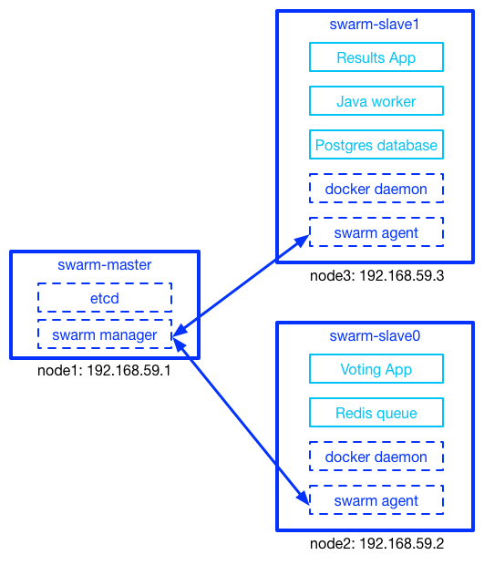

##Run Docker Birthday 3 App on a Dockerized Swarm Cluster

####Introduction

By default, we only run the App on a single Docker Host. Actually, we can easily run the App on a Docker Swarm Cluster of multiple nodes with exact the same docker-compose command:

```
docker-compose up -d
```

However, deploying Docker Swarm manually is challenging for beginners. Therefore, I decide to package Docker Swarm into Docker images. Then Docker Swarm can be deployed by running a simple shell script in a few minutes.

```
sudo ./deploy-swarm.sh
```

Sounds interesting? Just follow my instruction.


####Architecture

Following picture shows the architecture of this project.



- swarm-master, swarm-slave0 and swarm-slave1 run in docker containers.
- swarm-master, swarm-slave0 and swarm-slave1 containers run on node1, node2 and node3 respectively.
- swarm manager and etcd run in swarm-master container.
- swarm agent and docker daemon run in swarm-slave container.
- Voting App and Redis queue run in swarm-slave0 container (node2) with docker-in-docker method
- Result App, Java worker and Postgres database run in swarm-slave1 container(node3) with docker-in-docker method

Node that Docker Swarm will scheduler all 5 App containers, therefore, the results can be different when you run the App.


####Step 1: Enable remote Docker execution

For example, there are 3 nodes with docker installed. We need to run Docker containers remotely these nodes. Therefore, for each node, we need to enable the tcp socket of docker daemon.

Edit docker configuration file:

```
sudo vim /etc/default/docker
``` 
Add "-H tcp://0.0.0.0:2375" for DOCKER_OPTS:

```
DOCKER_OPTS="-H tcp://0.0.0.0:2375 -H unix:///var/run/docker.sock"
```

Restart docker daemon

```
sudo service restart docker
```


####Step 2: Deploy Docker Swarm

Following table shows the IP address of 3 nodes and corresponding container running on these nodes.

| Node     | IP           | Container    |
|----------|--------------|--------------|
| node1    | 192.168.59.1 | swarm-master |
| node2    | 192.168.59.2 | swarm-slave0 |
| node3    | 192.168.59.3 | swarm-slave1 |

Inside "deploy-swarm.sh", you need to specify the IP address of Master and slave nodes. In addition, you also need to specify the network interface of corresponding IP address.

```
MASTER_IP=192.168.59.1
SLAVE_IP=(192.168.59.2 192.168.59.3)
INTERFACE=eth1
```

**Deploy Docker Swarm cluster:**

```
cd docker-birthday-3/example-voting-app/swarm
sudo ./deploy-swarm.sh
```

It will take a few minutes to download kiwenlau/swarm:1.10 images and start containers on each node. Then, you can see:

```
delete all swarm containers on all nodes

start swarm-master container on 192.168.59.1
start swarm-slave0 container on 192.168.59.2
start swarm-slave1 container on 192.168.59.3

checking the status of swarm cluster, please wait...

swarm is running
```

####Step 3: Run App on Docker Swarm

**Set environment variable "DOCKER_HOST"**(Swarm manager listen on port 2376)

```
export DOCKER_HOST=tcp://0.0.0.0:2376
```

**Run App on Docker Swarm**

```
cd docker-birthday-3/example-voting-app/swarm
docker-compose up -d
```

Check all containers

```
sudo docker ps -a
```

```
CONTAINER ID        IMAGE                         COMMAND                  CREATED             STATUS              PORTS                          NAMES
2fd64512f08d        kiwenlau/result-app           "node server.js"         7 seconds ago       Up 5 seconds        192.168.59.3:5001->80/tcp      node3/swarm_result-app_1
4e797ca79d5e        kiwenlau/voting-app           "python app.py"          8 seconds ago       Up 7 seconds        192.168.59.2:5000->80/tcp      node2/swarm_voting-app_1
081234a67e0f        manomarks/worker              "java -jar target/wor"   9 seconds ago       Up 8 seconds                                       node3/swarm_worker_1
fea2b19ec68e        redis:alpine                  "/entrypoint.sh redis"   10 seconds ago      Up 9 seconds        192.168.59.2:32768->6379/tcp   node2/redis
f8ab4bba68ee        postgres:9.4                  "/docker-entrypoint.s"   10 seconds ago      Up 9 seconds        5432/tcp                       node3/db
```

Therefore, Voting App and Redis queue container run on node2, while Result App, Java worker and Postgres database container run on node3. You can check the App with following address

- Voting App: [http://192.168.59.2:5000/](http://192.168.59.2:5000/)
- Result App: [http://192.168.59.3:5001/](http://192.168.59.3:5001/)


####Notes

- Local directory such as "voting-app" and "result-app" can not be mounted as volume across hosts.
- It's difficult to synchronize the same image across multiple hosts, therefore, building images on Docker Swarm cluster will be annoying. Please building images on local host and then just run the App using built images.
- On node1(192.168.59.1), local docker daemon listen on port 2375 while docker swarm manager listen on 2376. Please use "export DOCKER_HOST=tcp://0.0.0.0:2376" and "unset DOCKER_HOST" to switch local/cluster mode.


